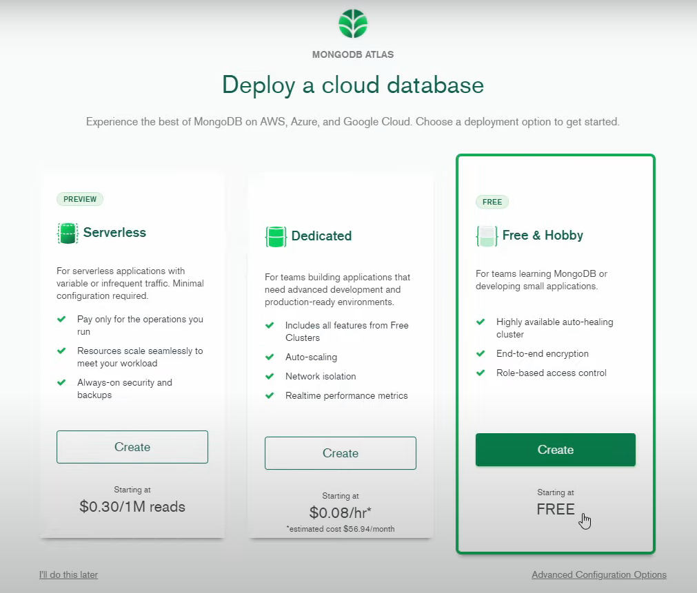

# contactsApp

## 1. Creación de la base de datos con MongoDB Atlas

Primeramente nos dirigiremos a [https://www.mongodb.com/es](https://www.mongodb.com/es) y nos crearemos una cuenta, acto seguido elegiremos la opción gratuita.



En el apartado de configuración, sencillamente **escogemos el provider que más nos guste y la región más cercana a nosotros.**

Una vez le damos a crear, tardará unos minutos en montarlo todo, mientras tanto podemos ir al apartado de **Security > Database Access y crear un usuario para nuestra base de datos.**


También necesitamos indicarle en el apartado de Network Access **desde qué direcciones IP vamos a conectarnos para que la base de datos nos permita acceder** a ella.

Aquí iría vuestra dirección IP pública o la dirección IP del servicio que quiere acceder a la base de datos. Como vamos a estar desarrollando la aplicación, **lo más cómodo es ponerla en "Allow access from anywhere" y posteriormente modificarlo.**


## 2. Configuración Inicial del Proyecto

Primeramente necesitaremos instalar [NodeJS,](https://nodejs.org/es/) una vez lo tengamos instalado, desde la terminal de tu sistema operativo y situándote en el directorio raíz de tu proyecto, ejecutaremos el siguiente comando para inizializar el proyecto con NodeJS:

```jsx
npm init --yes
```

También necesitaremos levantar un servidor web, y nada mejor para esto que **[Express](https://en.wikipedia.org/wiki/Express.js)**

```jsx
npm i express
```

Lo siguiente que haremos será crear la carpeta "**src"** en la raíz del proyecto, y dentro de ella, el archivo **index.js,** donde escribiremos el código del servidor.

```jsx
const express = require("express"); // Requerimos express como módulo

const app = express(); // Se le asigna una constante para un mejor manejo
const port = process.env.PORT || 9000; // Puerto en el que funcionará el servidor

app.listen(port, () => console.log("server listening on port", port));

// Finalmente declaramos mediante el método listen que nuestro server escucha por
// el puerto indicado, y que cuando conecte, imprima un mensaje en pantalla.
```

Al asignar **process.env.PORT** a nuestra constante, **conseguimos que utilice el puerto asignado por el entorno** **en el que se encuentre** si así lo necesitásemos (por ejemplo una web de hosting), en caso contrario, usaría el puerto 9000.

Antes de continuar, **instalaremos nodemon,** es un paquete que permite al servidor **actualizarse automáticamente cada vez que guardemos nuestros cambios**, lo que lo hace super útil a la hora de desarrollar.

Como se trata de una **dependencia de desarrollo**, es decir, que no se necesita para que la app funcione, **agregaremos la flag -D**

```jsx
npm i nodemon -D
```

Es un buen momento para hablar del archivo **package.json,** este archivo **es el corazón de cualquier proyecto de NodeJS. Almacena todos las dependencias y módulos requeridos por el proyecto, define el punto de entrada, define scripts...**

Si echamos un ojo a nuestro package.json veremos que aparecen **express y nodemon como dependencias.**

```json
{
  "name": "webAppProyecto",
  "version": "1.0.0",
  "description": "",
  "main": "index.js",
  "scripts": {
    "test": "echo \"Error: no test specified\" && exit 1"
  },
  "keywords": [],
  "author": "",
  "license": "ISC",
  "dependencies": { 	    // Dependencias para el correcto funcionamiento de la aplicación
    "express": "^4.17.1"
  },
  "devDependencies": {     // Dependencias para el desarrollo de la aplicación

    "nodemon": "^2.0.15"
  }
}
```

Ahora que entendemos qué es y para qué sirve el package.json, es momento de **cambiar el script de inicialización** que trae por defecto.

```json
{
  "name": "webAppProyecto",
  "version": "1.0.0",
  "description": "",
  "main": "index.js",
  "scripts": {
    "start": "nodemon src/index.js" // Hacemos que nodemon inicialice index.js
  },
  "keywords": [],
  "author": "",
  "license": "ISC",
  "dependencies": {
    "express": "^4.17.1"
  },
  "devDependencies": {
    "nodemon": "^2.0.15"
  }
}
```

Ahora es el momento de **iniciar el servidor.**

```jsx
npm run start
```

Navegamos a [localhost:9000](http://localhost:9000), **y deberíamos de recibir el error "Cannot GET /"**

Esto **ocurre por que no tenemos rutas definidas todavía**, entonces el servidor nos devuelve un error.

> Si no hubiésemos instalado nodemon, **tendríamos que apagar y volver a encender el servidor cada vez que cambiásemos algo en el proyecto**, de esta manera, podemos desarrollar de una manera mucho más cómoda y eficiente.

Nos dirigiremos a nuestro archivo **index.js,** y definiremos una ruta raíz mediante el **método get**.

```jsx
const express = require("express");

const app = express();
const port = process.env.PORT || 9000;

// Nuestras rutas

app.get("/", (req, res) => {
  res.send("Welcome to my Web App");
});

app.listen(port, () => console.log("server listening on port", port));
```

Al método get se le pasan dos valores, **el primero es la ruta y el segundo es una función flecha con los valores request y response,** donde podremos indicar lo que queremos que nos devuelva.

## MongoDB

Nosotros **vamos a estar utilizando la base de datos no-relacional [MongoDB](https://www.mongodb.com/es)**, pero se podría utilizar una base de datos SQL como [MySQL](https://www.mysql.com/) o directamente almacenar nuestros datos en arrays de JavaScript si así lo deseásemos.

Para el mejor manejo de la base de datos, **vamos a instalar el paquete [Mongoose](https://codigofacilito.com/articulos/que-es-mongoose)**, que nos otorgará características como **validaciones, construcción de queries, middlewares....** A demás de todo esto, **simplifica la sintáxis** a la hora de escribir el código.

Volveremos a la terminal, y con **CTRL+C apagamos el server**. Escribimos el siguiente comando

```jsx
npm i mongoose
```

Esto instalará el paquete y lo añadirá al package.json, y como no podía ser de otra manera, **vamos a requerirlo en nuestro index.js y a establecer la conexión con la base de datos.**

```jsx
const express = require("express");
const mongoose = require("mongoose"); // Requerimos mongoose

const app = express();
const port = process.env.PORT || 9000;

// routes

app.get("/", (req, res) => {
  res.send("Welcome to my Web App");
});

// Mongoose

mongoose.connect("Tu_Key"); // Necesitamos pasarle nuestra key de MongoDB como parámetro

app.listen(port, () => console.log("server listening on port", port));
```

Podemos obtener la key dirigiéndonos a la **dashboard de MongoDB, en driver seleccionamos NodeJS junto con su versión correspondiente.**


Sin embargo, pegar nuestra key en texto plano directamente en el código, no es lo más práctico.

**Vamos a crear una variable de entorno para poder acceder a ella tantas veces como queramos** (como la que usamos para definir el puerto), y que nuestro código esté mas limpio y organizado.

> No es lo mismo ver una string larguísima, que dios sabe qué significa, que ver una variable que se llame MONGODB_URI

Para crear variables de entorno personalizadas, **vamos a instalar un nuevo paquete llamado dotenv.**

```jsx
npm i dotenv
```

Posteriormente **lo requerimos en index.js**

```jsx
const express = require("express");
const mongoose = require("mongoose");
require("dotenv").config();

const app = express();
const port = process.env.PORT || 9000;

// routes

app.get("/", (req, res) => {
  res.send("Welcome to my Web App");
});

// Mongoose

mongoose.connect();

app.listen(port, () => console.log("server listening on port", port));
```

En esta ocasión no será necesario asignarle una constante, ya que solo con declararlo ya podremos acceder a nuestras propias variables de entorno. Las vamos a definir en un archivo llamado "**.env"** que estará localizado en la raíz de nuestro proyecto.

```jsx
MONGODB_URI =
  "mongodb+srv://<TU_USUARIO>:<TU_PASSWORD>@cluster0.ybp3b.mongodb.net/myFirstDatabase?retryWrites=true&w=majority";
```

Una vez definida la variable de entorno volvemos a index.js

```jsx
const express = require("express");
const mongoose = require("mongoose");
require("dotenv").config();

const app = express();
const port = process.env.PORT || 9000;

// routes

app.get("/", (req, res) => {
  res.send("Welcome to my Web App");
});

// Mongoose

mongoose
  .connect(process.env.MONGODB_URI)
  .then(() => console.log("Connected to Mongo")) // Nos conectamos a la base de datos
  .catch((error) => console.error(error));

// Si la conexión es satisfactoria, devuelve "Connected to Mongo"
// Si ocurre un error, devuelve el error.

app.listen(port, () => console.log("server listening on port", port));
```

Reiniciamos el servidor, y **debería de salirnos en consola "Connected to Mongo"**

Ahora es momento de definir las rutas de nuestra Web App.

# 3. Rutas

Antes, definimos una ruta raíz en el archivo index.js, sin embargo, **es preferible definir las rutas en su propio directorio y archivo.**

Para ello **crearemos un nuevo directorio dentro de src llamado routes.**

Dentro de este directorio, **crearemos un archivo llamado user.js,** donde definiremos todas las rutas que queramos, en este caso para la api del servidor.

```jsx
const express = require("express"); // Requerimos express
const router = express.Router(); // Asignamos el método router a una constante

// Nuestras rutas

module.exports = router; // Exportamos las rutas para que los demás archivos puedan acceder 
					// a ellas
```

El módulo router nos servirá para definir todas estas rutas, **empezaremos por definir una ruta para nuestra [API](https://www.redhat.com/es/topics/api/what-are-application-programming-interfaces).**

```js
const express = require("express");
const router = express.router();

router.post("/users", (req, res) => { // Usamos el método post
  res.send("create user");
});

module.exports = router;
```

De momento, esta ruta no devuelve nada, para poder trabajar con ella la tenemos que **"añadir" a nuestro index.js** 

```js
const express = require("express");
const mongoose = require("mongoose");
require("dotenv").config();
const userRoutes = require("./routes/user); // Requerimos nuestro archivo user

const app = express();
const port = process.env.PORT || 9000;

// middleware

app.use("/api", userRoutes); // Mediante el método use, indicamos que queremos usar
														// "/api" como prefijo de nuestras rutas

// routes

app.get("/", (req, res) => {
  res.send("Welcome to my Web App");
});

// Mongoose

mongoose
  .connect(process.env.MONGODB_URI)
  .then(() => console.log("Connected to Mongo"))
  .catch((error) => console.error(error));
app.listen(port, () => console.log("server listening on port", port));
```

Una vez requeridas las rutas, usando **"app.use"**, agregamos el  prefijo "/api"a todas nuestras rutas especificadas en user.js. **Todo software que se sitúa entre el sistema operativo y las aplicaciones que corren sobre él se denomina [middleware](https://es.wikipedia.org/wiki/Middleware#:~:text=El middleware es todo software,de datos en aplicaciones distribuidas.).**

Ahora la ruta que definimos en user.js funciona correctamente, solo que solo devuelve una string ("create user"). Lo que tenemos que hacer ahora es indicarle **cómo va a crear ese usuario.**

> Mientras creamos nuestras rutas **será necesario testearlas y ver qué valores nos retornan,** para ello vamos a utilizar una [**extensión de VSCode llamada REST Client**](https://marketplace.visualstudio.com/items?itemName=humao.rest-client) aun que podríamos utilizar multitud de herramientas como [Postman](https://www.postman.com/).

Una vez instalada la extensión, **crearemos un archivo llamado "requests.http" en la raíz del proyecto.** Acto seguido le indicamos **dónde queremos hacer la request:**

```js
### 
POST <http://localhost:9000/api/users> HTTP/1.1 // Request a /api/users
Content-Type: application/json // Le indicamos el tipo de contenido que va a devolver
						    // En este caso un JSON

{}
```

Si le damos a send request nos devolverá lo siguiente:

```js
HTTP/1.1 200 OK
X-Powered-By: Express
Content-Type: text/html; charset=utf-8
Content-Length: 11
ETag: W/"b-RiuDmWuTiJQ+XuV6F6PhreGRiB0"
Date: Tue, 16 Nov 2021 17:48:11 GMT
Connection: close

create user // Parámetro de nuestra función users
```

Si nos fijamos, **nos devuelve la string que pusimos como parámetro en la ruta de users.js,** lo cual significa que funciona correctamente.

## Creación del modelo de datos con Mongoose

Para conseguir que nuestra ruta cree un usuario, o cualquier cosa en general, **le debemos de asignar un modelo de datos**. Este modelo lo tenemos que crear nosotros, en este caso **como usamos MongoDB, lo crearemos con Mongoose.** 

> En cierta manera **los modelos de datos se parecen bastante a cuando defines una tabla en SQL**

Nos dirigimos a la carpeta src y **crearemos una carpeta llamada "models"**. Dentro de esta **crearemos el archivo user.js**, donde se definirán los modelos de datos para nuestro objeto user.

```js
// models/user.js
const mongoose = require("mongoose"); // Requerimos mongoose

const userSchema = mongoose.Schema({ // Definimos el schema y lo asignamos a una constante
  name: {
    type: String,
    required: true,
  },
  surname: {
    type: String,
    required: true,
  },
  phone: {
    type: Number,
    required: true,
  },
  email: {
    type: String,
    required: false,
  },
});

module.exports = mongoose.model("User", userSchema); // Importante exportarlo para que luego en routes/user.js podamos requerirlo

// ¿A que ahora el el modelo de datos tiene algo más de sentido?
```

Y posteriormente **lo importamos en routes/user.js para poder trabajar con él** 

```js
const express = require("express");
const router = express.Router();
const userSchema = require("../models/user"); // <=================

router.post("/users", (req, res) => {
  res.send("create user");
});

module.exports = router;

```

Si tuviésemos que trabajar con algún otro tipo de dato, **tendríamos que repetir estos pasos para definir su modelo de datos**, sin embargo, mi proyecto trata sobre una agenda de contactos, así que con definir un modelo (el de los contactos, en este caso se llama user) sería más que suficiente.

> Un modelo de datos, **define el tipo de datos que envía y recibe nuestra api**, también **es necesario para trabajar con el servidor y la base de datos, y que estos se comuniquen entre ellos.**

Ahora que tenemos el modelo de datos, **es momento de ir a nuestra ruta ( *routes/user.js* ) y añadirle el código necesario para que cree un usuario:**

```js
const express = require("express");
const router = express.Router();
const userSchema = require("../models/user");

// Crear un nuevo usuario
router.post("/users", (req, res) => {
  const user = userSchema(req.body); // Creamos el schema, que tendrá como input el cuerpo de la request que hace el cliente a la api
  user
    .save() // Lo intentamos guardar en la base de datos con .save()
    .then((data) => // Si se guarda de manera satisfactoria, entonces devuelve los datos en formato json
      res.json(data).catch((error) => res.json({ message: error })) // Si sale mal, nos devuelve un json con el mensaje de error
    );
});

module.exports = router;
```

Una vez tenemos agregado el código, sólo nos queda realizar la prueba de fuego para comprobar que funciona correctamente, **usar el REST Client y ver qué nos devuelve.**

