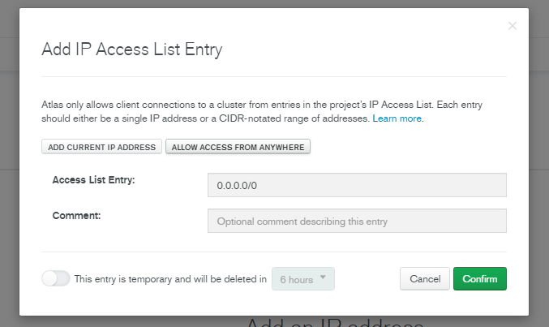
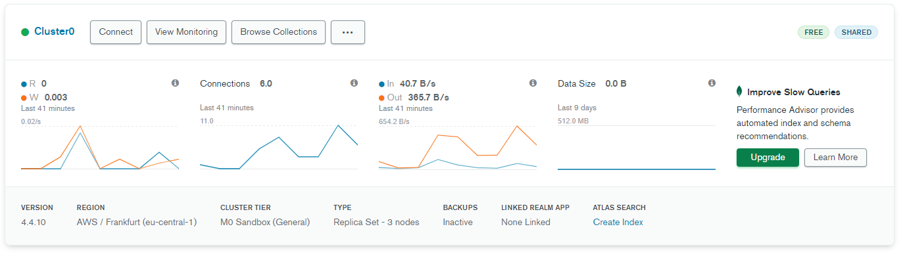
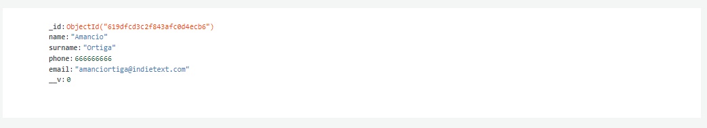

# Tabla de Contenido

[Desarrollo y documentación del proyecto](#desarrollo-y-documentación-del-proyecto)

- [Configuración Inicial del Proyecto](#configuración-inicial-del-proyecto)
  - [Instalación de NodeJS - Express y Nodemon](#instalación-de-nodejs---express-y-nodemon)
  - [Setup de MongoDB y Variables de Entorno](#setup-de-mongodb-y-variables-de-entorno)
- [Archivo de Rutas y modelo de datos](#archivo-de-rutas-y-modelo-de-datos)
  - [Archivo de Rutas](#archivo-de-rutas)
  - [Creación del modelo de datos con Mongoose](#creación-del-modelo-de-datos-con-mongoose)
- [Definición de endpoints](#definición-de-endpoints)
  - [Creación de usuarios](#creación-de-usuarios)
  - [Devolver todos los contactos](#devolver-todos-los-contactos)
  - [Devolver un contacto en concreto](#devolver-un-contacto-en-concreto)
  - [Modificar un contacto](#modificar-un-contacto)
  - [Borrar contactos](#borrar-contactos)

# Desarrollo y documentación del proyecto

## Configuración Inicial del Proyecto

Antes de empezar, crearemos nuestra base de datos para su posterior uso. Usaremos MongoDB Atlas ya que nos proporciona un hosting de base de datos de manera gratuita, lo cual está genial para trabajar en un proyecto como este.

Nos dirigiremos a [https://www.mongodb.com/es](https://www.mongodb.com/es) y nos crearemos una cuenta, acto seguido elegiremos la opción gratuita.

En el apartado de configuración, sencillamente **escogemos el provider que más nos guste y la región más cercana a nosotros.**

Una vez le damos a crear, tardará unos minutos en montarlo todo, mientras tanto podemos ir al apartado de **Security > Database Access y crear un usuario para nuestra base de datos.

También necesitamos indicarle en el apartado de Network Access **desde qué direcciones IP vamos a conectarnos para que la base de datos nos permita acceder** a ella.

Aquí iría vuestra dirección IP pública o la dirección IP del servicio que quiere acceder a la base de datos. Como vamos a estar desarrollando la aplicación, **lo más cómodo es ponerla en "Allow access from anywhere" y posteriormente modificarlo.**



### Instalación de NodeJS - Express y Nodemon

Primeramente necesitaremos instalar [NodeJS,](https://nodejs.org/es/) una vez lo tengamos instalado, desde la terminal del sistema operativo y situándose en el directorio raíz del proyecto, ejecutaremos el siguiente comando para inizializar el proyecto con NodeJS:

```jsx
npm init --yes
```

También necesitaremos levantar un servidor web, y nada mejor para esto que **[Express](https://en.wikipedia.org/wiki/Express.js)**

```jsx
npm i express
```

Lo siguiente que haremos será crear la carpeta "**src"** en la raíz del proyecto, y dentro de ella, el archivo **index.js,** donde escribiremos el código del servidor.

```jsx
const express = require("express"); // Requerimos express como módulo

const app = express(); // Se le asigna una constante para un mejor manejo
const port = process.env.PORT || 9000; // Puerto en el que funcionará el servidor

app.listen(port, () => console.log("server listening on port", port));

// Finalmente declaramos mediante el método listen que nuestro server escucha por
// el puerto indicado, y que cuando conecte, imprima un mensaje en pantalla.
```

Al asignar **process.env.PORT** a nuestra constante, **conseguimos que utilice el puerto asignado por el entorno** **en el que se encuentre** si así lo necesitásemos (por ejemplo una web de hosting), en caso contrario, usaría el puerto 9000.

Antes de continuar, **instalaremos nodemon,** es un paquete que permite al servidor **actualizarse automáticamente cada vez que guardemos nuestros cambios**, lo que lo hace super útil a la hora de desarrollar.

Como se trata de una **dependencia de desarrollo**, es decir, que no se necesita para que la app funcione, **agregaremos la flag -D**

```jsx
npm i nodemon -D
```

Es un buen momento para hablar del archivo **package.json,** este archivo **es el corazón de cualquier proyecto de NodeJS. Almacena todos las dependencias y módulos requeridos por el proyecto, define el punto de entrada, define scripts...**

Si echamos un ojo a nuestro package.json veremos que aparecen **express y nodemon como dependencias.**

```js
{
  "name": "webAppProyecto",
  "version": "1.0.0",
  "description": "",
  "main": "index.js",
  "scripts": {
    "test": "echo \"Error: no test specified\" && exit 1"
  },
  "keywords": [],
  "author": "",
  "license": "ISC",
  "dependencies": { 	    // Dependencias para el correcto funcionamiento de la aplicación
    "express": "^4.17.1"
  },
  "devDependencies": {     // Dependencias para el desarrollo de la aplicación

    "nodemon": "^2.0.15"
  }
}
```

Ahora que entendemos qué es y para qué sirve el package.json, es momento de **cambiar el script de inicialización** que trae por defecto. **Este script define los parámetros a la hora de iniciar el servidor**, en nuestro caso vamos a poner que inicie el servidor con nodemon.

```js
{
  "name": "webAppProyecto",
  "version": "1.0.0",
  "description": "",
  "main": "index.js",
  "scripts": {
    "start": "nodemon src/index.js" // Hacemos que nodemon inicialice index.js
  },
  "keywords": [],
  "author": "",
  "license": "ISC",
  "dependencies": {
    "express": "^4.17.1"
  },
  "devDependencies": {
    "nodemon": "^2.0.15"
  }
}
```

Ahora es el momento de **iniciar el servidor.**

```jsx
npm run start
```

Navegamos a [localhost:9000](http://localhost:9000), **y deberíamos de recibir el error "Cannot GET /"**

Esto **ocurre por que no tenemos rutas definidas todavía**, entonces el servidor nos devuelve un error.

> Si no hubiésemos instalado nodemon, **tendríamos que apagar y volver a encender el servidor cada vez que cambiásemos algo en el proyecto**, de esta manera, podemos desarrollar de una manera mucho más cómoda y eficiente.

Nos dirigiremos a nuestro archivo **index.js,** y definiremos una ruta raíz mediante el **método get**.

```jsx
const express = require("express");

const app = express();
const port = process.env.PORT || 9000;

// Nuestras rutas

app.get("/", (req, res) => {
  res.send("Welcome to my Web App");
});

app.listen(port, () => console.log("server listening on port", port));
```

Al método get se le pasan dos valores, **el primero es la ruta y el segundo es una función flecha con los valores request y response,** donde podremos indicar lo que queremos que nos devuelva.

### Setup de MongoDB y Variables de Entorno

Nosotros **vamos a estar utilizando la base de datos no-relacional [MongoDB](https://www.mongodb.com/es)**, pero se podría utilizar una base de datos SQL como [**MySQL**](https://www.mysql.com/) o directamente almacenar nuestros datos en arrays de JavaScript si así lo deseásemos.

Para el mejor manejo de la base de datos, **vamos a instalar el paquete [Mongoose](https://codigofacilito.com/articulos/que-es-mongoose)**, que nos otorgará características como **validaciones, construcción de queries, middlewares....** A demás de todo esto, **simplifica la sintáxis** a la hora de escribir el código.

Volveremos a la terminal, y con **CTRL+C apagamos el server**. Escribimos el siguiente comando

```jsx
npm i mongoose
```

Esto instalará el paquete y lo añadirá al package.json, y como no podía ser de otra manera, **vamos a requerirlo en nuestro index.js y a establecer la conexión con la base de datos.**

```jsx
const express = require("express");
const mongoose = require("mongoose"); // Requerimos mongoose

const app = express();
const port = process.env.PORT || 9000;

// routes

app.get("/", (req, res) => {
  res.send("Welcome to my Web App");
});

// Mongoose

mongoose.connect("Tu_Key"); // Necesitamos pasarle nuestra key de MongoDB como parámetro

app.listen(port, () => console.log("server listening on port", port));
```

Podemos obtener la key dirigiéndonos a la **dashboard de MongoDB, en driver seleccionamos NodeJS junto con su versión correspondiente.**

Sin embargo, pegar nuestra key en texto plano directamente en el código, no es lo más práctico.

**Vamos a crear una variable de entorno para poder acceder a ella tantas veces como queramos** (como la que usamos para definir el puerto), y que nuestro código esté mas limpio y organizado.

> No es lo mismo ver una string larguísima, que dios sabe qué significa, que ver una variable que se llame MONGODB_URI

Para crear variables de entorno personalizadas, **vamos a instalar un nuevo paquete llamado dotenv.**

```jsx
npm i dotenv
```

Posteriormente **lo requerimos en index.js**

```jsx
const express = require("express");
const mongoose = require("mongoose");
require("dotenv").config();

const app = express();
const port = process.env.PORT || 9000;

// routes

app.get("/", (req, res) => {
  res.send("Welcome to my Web App");
});

// Mongoose

mongoose.connect();

app.listen(port, () => console.log("server listening on port", port));
```

En esta ocasión **no será necesario asignarle una constante, ya que solo con declararlo ya podremos acceder a nuestras propias variables de entorno.** Las vamos a definir en un archivo llamado "**.env"** que estará localizado en la raíz de nuestro proyecto.

```jsx
MONGODB_URI =
  "mongodb+srv://<TU_USUARIO>:<TU_PASSWORD>@cluster0.ybp3b.mongodb.net/myFirstDatabase?retryWrites=true&w=majority"
```

Una vez definida la variable de entorno volvemos a index.js

```jsx
const express = require("express");
const mongoose = require("mongoose");
require("dotenv").config();

const app = express();
const port = process.env.PORT || 9000;

// routes

app.get("/", (req, res) => {
  res.send("Welcome to my Web App");
});

// Mongoose

mongoose
  .connect(process.env.MONGODB_URI)
  .then(() => console.log("Connected to Mongo")) // Nos conectamos a la base de datos
  .catch((error) => console.error(error));

// Si la conexión es satisfactoria, devuelve "Connected to Mongo"
// Si ocurre un error, devuelve el error.

app.listen(port, () => console.log("server listening on port", port));
```

Reiniciamos el servidor, y **debería de salirnos en consola "Connected to Mongo"**

## Archivo de Rutas y modelo de datos

Ahora **es momento de definir las rutas** de nuestra Web App. Antes, definimos una ruta raíz en el archivo index.js, sin embargo, **es preferible definir las rutas en su propio directorio y archivo.** De esta manera nuestro proyecto estará mucho más organizado, y cuando queramos modificar el código nos será infinitamente más fácil hacerlo.

### Archivo de Rutas

Para ello **crearemos un nuevo directorio dentro de src llamado routes.**

Dentro de este directorio, **crearemos un archivo llamado user.js,** donde definiremos todas las rutas que queramos, en este caso para la api del servidor.

```jsx
const express = require("express"); // Requerimos express
const router = express.Router(); // Asignamos el método router a una constante

// Nuestras rutas

module.exports = router; // Exportamos las rutas para que los demás archivos puedan acceder a ellas
```

El módulo router nos servirá para definir todas estas rutas, **empezaremos por definir una ruta para nuestra [API](https://www.redhat.com/es/topics/api/what-are-application-programming-interfaces).**

```js
const express = require("express");
const router = express.router();

router.post("/users", (req, res) => {
  // Usamos el método post
  res.send("create user");
});

module.exports = router;
```

De momento, esta ruta no devuelve nada, para poder trabajar con ella la tenemos que **"añadir" a nuestro index.js**

```js
const express = require("express");
const mongoose = require("mongoose");
require("dotenv").config();
const userRoutes = require("./routes/user); // Requerimos nuestro archivo user

const app = express();
const port = process.env.PORT || 9000;

// middleware

app.use("/api", userRoutes); // Mediante el método use, indicamos que queremos usar "/api" como prefijo de nuestras rutas

// routes

app.get("/", (req, res) => {
  res.send("Welcome to my Web App");
});

// Mongoose

mongoose
  .connect(process.env.MONGODB_URI)
  .then(() => console.log("Connected to Mongo"))
  .catch((error) => console.error(error));
app.listen(port, () => console.log("server listening on port", port));
```

Una vez requeridas las rutas, usando **"app.use"**, agregamos el prefijo "/api"a todas nuestras rutas especificadas en user.js.

> **Todo software que se sitúa entre el sistema operativo y las aplicaciones que corren sobre él se denomina [middleware](https://es.wikipedia.org/wiki/Middleware#:~:text=El middleware es todo software,de datos en aplicaciones distribuidas.).**

Ahora la ruta que definimos en user.js funciona correctamente, solo que solo devuelve una string ("create user"). Lo que tenemos que hacer ahora es indicarle **cómo va a crear ese usuario.**

> Mientras creamos nuestras rutas **será necesario testearlas y ver qué valores nos retornan,** para ello vamos a utilizar una [**extensión de VSCode llamada REST Client**](https://marketplace.visualstudio.com/items?itemName=humao.rest-client) aun que podríamos utilizar multitud de herramientas como [Postman](https://www.postman.com/).

Una vez instalada la extensión, **crearemos un archivo llamado "requests.http" en la raíz del proyecto.** Acto seguido le indicamos **dónde queremos hacer la request:**

```js
###
POST <http://localhost:9000/api/users> HTTP/1.1 // Request a /api/users
Content-Type: application/json // Le indicamos el tipo de contenido que va a devolver, en este caso un JSON

{}
```

Si le damos a send request nos devolverá lo siguiente:

```js
HTTP/1.1 200 OK
X-Powered-By: Express
Content-Type: text/html; charset=utf-8
Content-Length: 11
ETag: W/"b-RiuDmWuTiJQ+XuV6F6PhreGRiB0"
Date: Tue, 16 Nov 2021 17:48:11 GMT
Connection: close

create user // Parámetro de nuestra función users
```

Si nos fijamos, **nos devuelve la string que pusimos como parámetro en la ruta de users.js,** lo cual significa que funciona correctamente.

### Creación del modelo de datos con Mongoose

Para conseguir que nuestra ruta cree un usuario, o cualquier cosa en general, **le debemos de asignar un modelo de datos**. Este modelo lo tenemos que crear nosotros, en este caso **como usamos MongoDB, lo crearemos con Mongoose.**

> En cierta manera **los modelos de datos se parecen bastante a cuando defines una tabla en SQL**

Nos dirigimos a la carpeta src y **crearemos una carpeta llamada "models"**. Dentro de esta **crearemos el archivo user.js**, donde se definirán los modelos de datos para nuestro objeto user.

```js
// models/user.js
const mongoose = require("mongoose"); // Requerimos mongoose

const userSchema = mongoose.Schema({
  // Definimos el schema y lo asignamos a una constante
  name: {
    type: String,
    required: true,
  },
  surname: {
    type: String,
    required: true,
  },
  phone: {
    type: Number,
    required: true,
  },
  email: {
    type: String,
    required: false,
  },
});

module.exports = mongoose.model("User", userSchema); // Importante exportarlo para que luego en routes/user.js podamos requerirlo

// ¿A que ahora el el modelo de datos tiene algo más de sentido?
```

Y posteriormente **lo importamos en routes/user.js para poder trabajar con él**

```js
const express = require("express");
const router = express.Router();
const userSchema = require("../models/user"); // <=================

router.post("/users", (req, res) => {
  res.send("create user");
});

module.exports = router;
```

Si tuviésemos que trabajar con algún otro tipo de dato, **tendríamos que repetir estos pasos para definir su modelo de datos**, sin embargo, mi proyecto trata sobre una agenda de contactos, así que **con definir un modelo** (el de los contactos, que en este caso se llama user) **sería más que suficiente**.

> Un modelo de datos, **define el tipo de datos que envía y recibe nuestra api**, también **es necesario para trabajar con el servidor y la base de datos, y que estos se comuniquen entre ellos.**


## Definición de endpoints

### Creación de usuarios

**Los endpoints son rutas que responden a una petición** y que normalmente devuelven JSONs

Ahora que tenemos el modelo de datos, **es momento de ir a nuestra ruta de creación de users (ubicada en *routes/user.js* ) y añadirle el código necesario para que cree un usuario:**

```js
const express = require("express");
const router = express.Router();
const userSchema = require("../models/user");

// Crear un nuevo usuario
router.post("/users", (req, res) => {
  const user = userSchema(req.body); // Creamos el schema, que tendrá como input el cuerpo de la request que hace el cliente a la api
  user
    .save() // Lo intentamos guardar en la base de datos con .save()
    .then((data) => res.json(data)) // Si se guarda de manera satisfactoria, entonces devuelve los datos en formato json
    .catch((error) => res.json({ message: error })); // Si sale mal, nos devuelve un json con el mensaje de error
});

module.exports = router;
```

Sin embargo, nuestro servidor **no entiende los parámetros en JSON por defecto**, si hacemos una request ahora mismo esta fallará.

Para que esto no suceda y podamos trabajar con JSONs, **nos dirigimos al apartado de middleware de index.js y agregamos la siguiente línea:**

```js
const express = require("express");
const mongoose = require("mongoose");
require("dotenv").config();
const userRoutes = require("./routes/user");

const app = express();
const port = process.env.PORT || 9000;

// middleware
app.use(express.json()); // Middleware de express para trabajar con JSONs
app.use("/api", userRoutes); 

// routes

app.get("/", (req, res) => {
  res.send("Welcome to my Web App");
});

// Mongoose

mongoose
  .connect(process.env.MONGODB_URI)
  .then(() => console.log("Connected to Mongo"))
  .catch((error) => console.error(error));
app.listen(port, () => console.log("server listening on port", port));

```

Es importante que vaya **antes de llamar a las rutas**, ya que **primero tiene que interpretar el JSON** antes de ejecutar ninguno de los endpoitns de la api.

Una vez tenemos agregado el código, sólo nos queda realizar la prueba de fuego para comprobar que funciona correctamente, **usar el REST Client y ver qué nos devuelve.** Para esto **volveremos a utilizar la extensión REST Client,** modificando el archivo **requests.http**

```http
POST http://localhost:9000/api/users HTTP/1.1
Content-Type: application/json

{
    "name": "Amancio",
    "surname": "Ortiga",
    "phone": "666666666",
    "email": "amanciortiga@indietext.com"

}
```

Es importante que al hacer la request, **el input JSON tenga todos los campos requeridos** en el modelo de datos que realizamos previamente. Si **name** es **required** y lo **omitimos**, nos **dará un error**.

Si todo sale bien aparecerá en pantalla un mensaje como el siguiente.

```http
HTTP/1.1 200 OK
X-Powered-By: Express
Content-Type: application/json; charset=utf-8
Content-Length: 133
ETag: W/"85-Psdg50xEB708uR0rd8wOFXgW3wA"
Date: Wed, 24 Nov 2021 09:18:11 GMT
Connection: close

{
  "name": "Amancio",
  "surname": "Ortiga",
  "phone": 666666666,
  "email": "amanciortiga@indietext.com",
  "_id": "619e03532c7c3039b4455eac",
  "__v": 0
}
```

Pero, **¿se habrá creado realmente el objeto en la base de datos?** Para comprobarlo vamos a dirigirnos a MongoDB Atlas, y en nuestro cluster clicaremos en **"Browse Collections"**



Y como podremos comprobar, **efectivamente se ha creado un nuevo registro en la base de datos:**

Ahora que hemos definido nuestra ruta y su función para crear nuevos usuarios (contactos en este caso), **debemos definir los endpoints restantes**, como borrar, actualizar u obtener los contactos.

### Devolver todos los contactos

Este endpoint es muy similar al anterior, **apenas tendremos que cambiar un par de cosas** en el código:

```js
// Devolver todos los contactos

router.get("/users", (req, res) => { // En vez de el método post usamos get para pedir información a la base de datos
  userSchema // En vez de pedir el contenido del modelo de datos, sencillamente indicamos que estaremos usando el esquema en sí, no sus valores
    .find() // Finalmente con el método find indicamos que busque todos los registros que coincidan con el esquema de el modelo de datos userSchema
    .then((data) => res.json(data))
    .catch((error) => res.json({ message: error }));
});
```

Probamos el endpoint y **hacemos una request** 

```http
GET http://localhost:9000/api/users HTTP/1.1
```

Deberíamos de obtener el siguiente **mensaje con una lista de todos los elementos.** He añadido unos cuantos más para que el ejemplo sea algo más práctico:

```http
HTTP/1.1 200 OK
X-Powered-By: Express
Content-Type: application/json; charset=utf-8
Content-Length: 513
ETag: W/"201-AjaUwabkhnw0ABVaYrLPO4o258Q"
Date: Wed, 24 Nov 2021 10:04:41 GMT
Connection: close

[
  {
    "_id": "619dfcd3c2f843afc0d4ecb6",
    "name": "Amancio",
    "surname": "Ortiga",
    "phone": 666666666,
    "email": "amanciortiga@indietext.com",
    "__v": 0
  },
  {
    "_id": "619e0cc7ec9d7bce4e1440c6",
    "name": "Uxia",
    "surname": "Camposanto",
    "phone": 987458512,
    "email": "uxia@inventing.com",
    "__v": 0
  },
  {
    "_id": "619e0e14ec9d7bce4e1440c9",
    "name": "Iago",
    "surname": "Rioxán",
    "phone": 698745821,
    "email": "iago@inventing.com",
    "__v": 0
  },
  {
    "_id": "619e0e38ec9d7bce4e1440cb",
    "name": "Xabier",
    "surname": "Breixo",
    "phone": 662146921,
    "email": "xabier@inventing.com",
    "__v": 0
  }
]

```

### Devolver un contacto en concreto

Ahora **vamos a definir el endpoint para obtener un contacto** en concreto. El cuerpo del endpoint sigue siendo muy similar a los dos anteriores, lo que tenemos que hacer ahora es **obtener el id del contacto para posteriormente buscarlo con el método findById**

```js
// Devolver un sólo contacto

router.get("/users/:id", (req, res) => { // Modificamos la ruta para que concatene el id con /users/
  const { id } = req.params; // Asignamos una constante { id } que obtendremos de los parámetros de la request
  userSchema
    .findById(id) // Usamos findById para buscar el contacto en cuestión
    .then((data) => res.json(data))
    .catch((error) => res.json({ message: error }));
});
```

Probamos el endpoint y hacemos una request, **usando el id del contacto en la ruta**

```http
GET http://localhost:9000/api/users/619dfcd3c2f843afc0d4ecb6 HTTP/1.1
```

Deberíamos de obtener **el contacto asociado al ID**

````http
HTTP/1.1 200 OK
X-Powered-By: Express
Content-Type: application/json; charset=utf-8
Content-Length: 133
ETag: W/"85-vxtppOSsFyfNEbSzJ6O1ZCXE9ho"
Date: Wed, 24 Nov 2021 10:15:13 GMT
Connection: close

{
  "_id": "619dfcd3c2f843afc0d4ecb6",
  "name": "Amancio",
  "surname": "Ortiga",
  "phone": 666666666,
  "email": "amanciortiga@indietext.com",
  "__v": 0
}
````

### Modificar un contacto

Vamos a crear el **endpoint que nos permitirá modificar los contactos.**

```js
// Actualizar contacto

router.put("/users/:id", (req, res) => { // Usamos PUT para actualizar
  const { id } = req.params;
  const { name, surname, phone, email } = req.body; // Definimos una constante que contenga todos los datos de nuestros contactos
  userSchema
    .updateOne({ _id: id }, { $set: { name, surname, phone, email } }) // Actualizamos con updateOne
    .then((data) => res.json(data))
    .catch((error) => res.json({ message: error }));
});
```

Con el método updateOne, **conseguimos modificar los registros de nuestra base de datos**.

Primeramente **nos pide el id como parámetro,** el cual obtenemos del propio registro y lo asignamos a la constante. **Como segundo parámetro, usamos un objeto con el parámetro $set,** que es el que actualizará todos los datos.

**Vamos a probar el endpoint** cambiando el número de teléfono de nuestro querido Amancio Ortiga:

```http
PUT http://localhost:9000/api/users/619dfcd3c2f843afc0d4ecb6 HTTP/1.1
Content-Type: application/json

{
    "name": "Amancio",
    "surname": "Ortiga",
    "phone": "685471236",
    "email": "amanciortiga@indietext.com"

}

```

Nos devolverá un mensaje conforme todo ha salido correctamente, y si volvemos a buscar a Amancio Ortiga en la base de datos, **su número de teléfono se habrá actualizado a "685471236"**

```http
HTTP/1.1 200 OK
X-Powered-By: Express
Content-Type: application/json; charset=utf-8
Content-Length: 133
ETag: W/"85-ROmV9l/pbttKqv00MQgONJIdEgc"
Date: Wed, 24 Nov 2021 10:39:25 GMT
Connection: close

{
  "_id": "619dfcd3c2f843afc0d4ecb6",
  "name": "Amancio",
  "surname": "Ortiga",
  "phone": 685471236,
  "email": "amanciortiga@indietext.com",
  "__v": 0
}
```

### Borrar contactos

Por último **definimos el endpoint para borrar contactos de nuestra agenda**, es el más sencillo de todos ya que solo le tenemos que pasar el Id correspondiente para que borre el contacto asociado a él.

```js
// Boorar contacto

router.delete("/users/:id", (req, res) => { // Usamos el método http delete
  const { id } = req.params; 
  userSchema
    .remove({ _id: id }) // Con .remove borramos el contacto asociado al id
    .then((data) => res.json(data))
    .catch((error) => res.json({ message: error }));
});
```

Probamos el endpoint, borrando a Amancio Ortiga (ya que no tiene mucho sentido que Amancio aparezca en su propia agenda)

```http
DELETE http://localhost:9000/api/users/619dfcd3c2f843afc0d4ecb6 HTTP/1.1
```

Nos debe de devolver el parámetro *delete count: 1*

Si obtenemos la lista de los contactos de nuevo, **veremos que Amancio ya no está entre ellos**

```http
HTTP/1.1 200 OK
X-Powered-By: Express
Content-Type: application/json; charset=utf-8
Content-Length: 379
ETag: W/"17b-g0g+TH9YnsEsQbabA96HRLy86nc"
Date: Wed, 24 Nov 2021 11:11:23 GMT
Connection: close

[
  {
    "_id": "619e0cc7ec9d7bce4e1440c6",
    "name": "Uxia",
    "surname": "Camposanto",
    "phone": 987458512,
    "email": "uxia@inventing.com",
    "__v": 0
  },
  {
    "_id": "619e0e14ec9d7bce4e1440c9",
    "name": "Iago",
    "surname": "Rioxán",
    "phone": 698745821,
    "email": "iago@inventing.com",
    "__v": 0
  },
  {
    "_id": "619e0e38ec9d7bce4e1440cb",
    "name": "Xabier",
    "surname": "Breixo",
    "phone": 662146921,
    "email": "xabier@inventing.com",
    "__v": 0
  }
]
```


